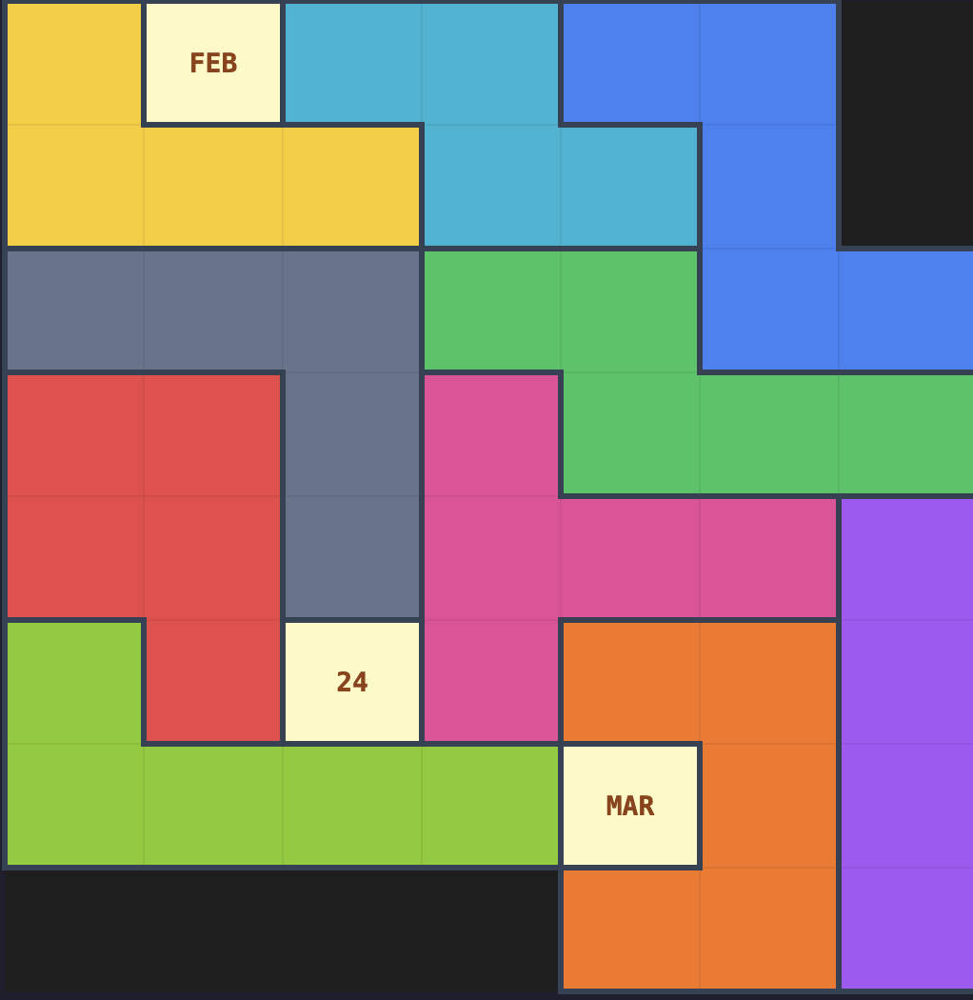

# Calendar Puzzle Solver

An ILP-based solver for the **Daily Calendar Puzzle** — a physical puzzle where
10 pieces must tile a board leaving exactly three cells exposed: the current
month, day, and weekday.

This implementation uses Spanish labels (ENE, FEB, ... / LUN, MAR, ...).



## The Problem

The board is an 8x7 grid with 50 labeled cells (12 months, 31 days, 7 weekdays).
Each day has a unique combination of three cells to leave uncovered, and the
remaining 47 cells must be perfectly tiled by 10 polyomino pieces — no gaps,
no overlaps.

## Breaking It Down

1. **Board abstraction** — An 8x7 grid where each cell is either playable
   (labeled) or blocked (`None`). Three cells are designated as _targets_
   for the date being solved.

2. **Piece transformations** — Each piece can be rotated (0/90/180/270 degrees)
   and reflected, producing up to 8 distinct orientations. Duplicate
   orientations (from symmetric pieces) are eliminated.

3. **Exact cover** — The 47 remaining cells must be partitioned among the 10
   pieces with no overlaps. This is a classic exact cover problem.

## Mathematical Model

The solver formulates an **Integer Linear Program** (ILP):

- **Variables** — A binary variable `x[piece, i]` for every valid placement
  (piece + orientation + position) on the board.

- **Constraints**
  - _One placement per piece:_ for each piece, exactly one of its placement
    variables equals 1.
  - _One piece per cell:_ for each playable cell, exactly one covering
    placement variable equals 1.

- **Objective** — None (feasibility problem). The solver simply finds any
  assignment satisfying all constraints.

PuLP with the CBC solver handles this in under a second for typical dates.

## Architecture

```
calendar_puzzle/
├── board.py      # Board class (grid + labels) and Piece dataclass (transforms)
├── solver.py     # Solver class — ILP formulation via PuLP
├── renderer.py   # Renderer class — HTML table output for Jupyter
└── __init__.py   # Public API: Board, Piece, Solver, Renderer
```

## Results

The solver finds valid tilings for any reachable date on the board.
See `notebooks/demo.ipynb` for visual examples.

## Quick Start

```bash
pip install -r requirements.txt
```

```python
from calendar_puzzle import Board, Solver, Renderer

board = Board()
solver = Solver(board)
renderer = Renderer(board)

result = solver.solve("FEB", 24, "MAR")
targets = board.target_cells("FEB", 24, "MAR")
renderer.show_board(result, targets)
```
